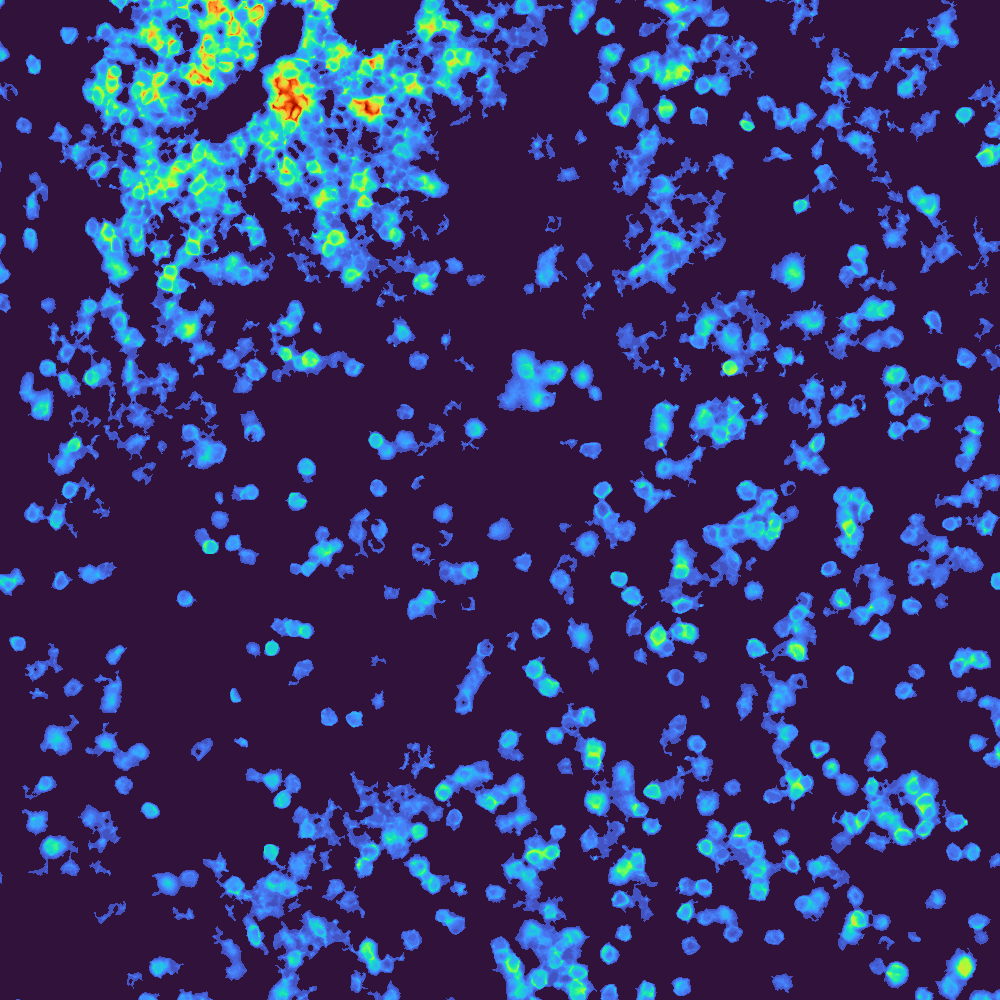

KINTSUGI Documentation
======================

**Knowledge Integration with New Technologies for Simplified User-Guided Image processing**

Multiplex image processing for challenging datasets with a focus on user integration
rather than automation. This pipeline includes 2D/3D GPU/CPU illumination correction,
stitching, deconvolution, extended depth of focus, registration, autofluorescence
removal, segmentation, clustering, and spatial analysis.

Citation
--------

Smith, J. A. et al. Protocol for processing and analyzing multiplexed images
improves lymphatic cell identification and spatial architecture in human tissue.
STAR Protocols 6, 103976 (2025).

Quick Links
-----------

- `GitHub Repository <https://github.com/smith6jt-cop/KINTSUGI>`_
- `Zenodo DOI <https://doi.org/10.5281/zenodo.14984518>`_
- `Test Data <https://zenodo.org/communities/kintsugi>`_

.. toctree::
   :maxdepth: 2
   :caption: Getting Started

   installation
   quickstart

.. toctree::
   :maxdepth: 2
   :caption: User Guide

   workflows
   cli
   api

.. toctree::
   :maxdepth: 2
   :caption: Reference

   TROUBLESHOOTING
   DEPENDENCY_ANALYSIS

.. toctree::
   :maxdepth: 1
   :caption: Development

   contributing
   DOCS_MAINTENANCE

Indices and tables
==================

* :ref:`genindex`
* :ref:`modindex`
* :ref:`search`
